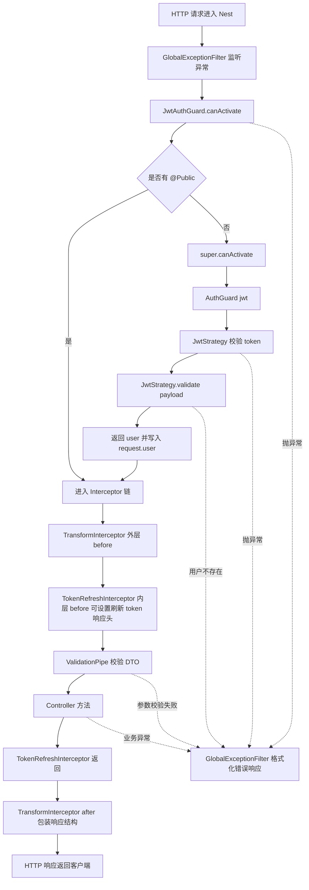

# 认证与拦截器执行流程图

## 当前全局组件

`AppModule` 当前注册了这些全局组件：

```ts
providers: [
  {
    provide: APP_INTERCEPTOR,
    useClass: TransformInterceptor,
  },
  {
    provide: APP_INTERCEPTOR,
    useClass: TokenRefreshInterceptor,
  },
  {
    provide: APP_FILTER,
    useClass: GlobalExceptionFilter,
  },
  {
    provide: APP_GUARD,
    useFactory: (reflector: Reflector) => new JwtAuthGuard(reflector),
    inject: [Reflector],
  },
  {
    provide: APP_PIPE,
    useFactory: () => new ValidationPipe(...),
  },
]
```

涉及认证与响应处理的具体类：

- `JwtAuthGuard`
- `JwtStrategy`
- `TokenRefreshInterceptor`
- `TransformInterceptor`
- `GlobalExceptionFilter`
- `ValidationPipe`

## 总览图



## 受保护接口执行顺序

以 `POST /api/users/searchFriend` 为例，它没有 `@Public()`，所以需要登录。

```txt
1. HTTP 请求进入 Nest

2. GlobalExceptionFilter 准备兜底捕获异常
   - 类名：GlobalExceptionFilter
   - 作用：把异常统一格式化为错误响应

3. 执行全局 Guard
   - 类名：JwtAuthGuard
   - 方法：canActivate(context)

4. JwtAuthGuard 检查 @Public()
   - 如果没有 @Public()，继续认证
   - 当前 searchFriend 没有 @Public()

5. JwtAuthGuard 调用 super.canActivate(context)
   - 进入 Nest Passport 的 AuthGuard('jwt')

6. AuthGuard('jwt') 查找 JWT strategy
   - 使用策略名：jwt
   - 对应类：JwtStrategy

7. JwtStrategy 提取 token
   - 使用：ExtractJwt.fromAuthHeaderAsBearerToken()
   - 从请求头读取：Authorization: Bearer <token>

8. passport-jwt 校验 token
   - 校验签名
   - 校验过期时间
   - 解析 payload

9. 执行 JwtStrategy.validate(payload)
   - 类名：JwtStrategy
   - 方法：validate(payload)
   - 逻辑：根据 payload.sub 查询用户

10. validate 返回 user
    - Passport 把 user 写入 request.user

11. 进入 Interceptor 链
    - 外层：TransformInterceptor
    - 内层：TokenRefreshInterceptor

12. 执行 TransformInterceptor before
    - 类名：TransformInterceptor
    - 动作：设置 response.status(200)
    - 然后调用 next.handle()

13. 执行 TokenRefreshInterceptor before
    - 类名：TokenRefreshInterceptor
    - 动作：
      - 读取 Authorization header
      - 确认 request.user 已存在
      - decode token 读取 exp
      - 如果 token 快过期，设置刷新 token 响应头
    - 不负责认证
    - 不写入 request.user

14. 执行 ValidationPipe
    - 类名：ValidationPipe
    - 动作：校验 body / query / params DTO

15. 执行 Controller 方法
    - 例如：UserController.searchFriend()

16. Controller 返回数据

17. TokenRefreshInterceptor 返回
    - 当前没有额外 after 逻辑
    - 刷新 token 响应头已经在进入 Controller 前设置完成

18. TransformInterceptor after
    - 包装响应结构：
      {
        result,
        code: 200,
        data,
        message
      }

19. HTTP 响应返回客户端
```

## 公开接口执行顺序

以 `POST /api/users/login` 为例，它有 `@Public()`。

```txt
1. HTTP 请求进入 Nest

2. GlobalExceptionFilter 准备兜底捕获异常

3. 执行 JwtAuthGuard.canActivate(context)

4. JwtAuthGuard 检查到 @Public()

5. 直接 return true

6. 不进入 AuthGuard('jwt')

7. 不执行 JwtStrategy.validate(payload)

8. 进入 Interceptor 链
   - TransformInterceptor
   - TokenRefreshInterceptor

9. TokenRefreshInterceptor 检查 Authorization header
   - 登录接口通常没有 Authorization header
   - 直接 next.handle()

10. 执行 ValidationPipe

11. 执行 Controller 方法
    - 例如：UserController.login()

12. AuthService.login() 签发 access_token

13. TransformInterceptor 包装响应

14. HTTP 响应返回客户端
```

## 当前 Interceptor 顺序

当前注册顺序：

```ts
APP_INTERCEPTOR -> TransformInterceptor
APP_INTERCEPTOR -> TokenRefreshInterceptor
```

可以按“洋葱模型”理解：

```txt
TransformInterceptor before
  ↓
TokenRefreshInterceptor before
  ↓
Controller
  ↑
TokenRefreshInterceptor return
  ↑
TransformInterceptor after
```

所以：

- `TransformInterceptor` 是外层
- `TokenRefreshInterceptor` 是内层
- 请求进入时先经过 `TransformInterceptor`
- `TokenRefreshInterceptor` 在进入 controller 前判断是否需要设置刷新 token 响应头
- 响应返回时最后经过 `TransformInterceptor`

## `request.user` 的来源

`request.user` 只应该由 Passport 写入。

具体来源：

```txt
JwtStrategy.validate(payload)
  ↓
return user
  ↓
Passport 写入 request.user
```

当前 `TokenRefreshInterceptor` 不再写入 `request.user`。

它只读取：

```ts
const user = request.user as any;
```

用于刷新 token：

```ts
const newToken = this.jwtService.sign(
  {
    sub: user.id,
    email: user.email,
    username: user.username,
  },
  {
    expiresIn: this.configService.get('jwt.expiresIn'),
  },
);
```

## 失败路径

### 缺少 token

```txt
JwtAuthGuard
  ↓
AuthGuard('jwt')
  ↓
没有 Authorization: Bearer <token>
  ↓
JwtAuthGuard.handleRequest()
  ↓
抛出 UnauthorizedException('缺少 Authorization 请求头')
  ↓
GlobalExceptionFilter 返回 401
```

### token 过期

```txt
AuthGuard('jwt')
  ↓
passport-jwt 校验 exp
  ↓
发现过期
  ↓
JwtAuthGuard.handleRequest()
  ↓
抛出 UnauthorizedException('Token 已过期，请重新登录')
  ↓
GlobalExceptionFilter 返回 401
```

### token 有效，但用户不存在

```txt
AuthGuard('jwt')
  ↓
token 签名和过期校验通过
  ↓
JwtStrategy.validate(payload)
  ↓
userService.findById(payload.sub)
  ↓
查不到用户
  ↓
抛出 UnauthorizedException('用户不存在')
  ↓
GlobalExceptionFilter 返回 401
```

## 一句话记忆

请求进入时：

```txt
Guard 先认证，再进 Interceptor，再进 Pipe，再进 Controller
```

响应返回时：

```txt
Controller 先返回，再经过 Interceptor after，最后返回客户端
```

当前项目认证相关的核心顺序是：

```txt
JwtAuthGuard
  -> AuthGuard('jwt')
  -> JwtStrategy.validate()
  -> TransformInterceptor
  -> TokenRefreshInterceptor
  -> ValidationPipe
  -> Controller
  -> TokenRefreshInterceptor
  -> TransformInterceptor
```
